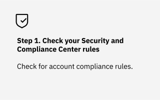
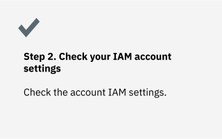
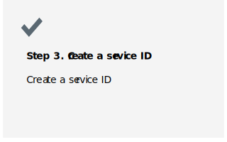

---

copyright:
  years: 2019, 2023
lastupdated: "2021-08-09"

keywords:

subcollection: atracker

---

{{site.data.keyword.attribute-definition-list}}

# Creating a service ID
{: #create_service_id}

When Activity Tracking collects auditing events in your account, it uses an API key to upload data into a bucket. Therefore, you must define credentials in your account to work with the {{site.data.keyword.cos_full_notm}} service.
{: shortdesc}

  

## Check your {{site.data.keyword.compliance_short}} rules
{: #create_service_id_1}

With the {{site.data.keyword.compliance_short}}, you can accomplish the following tasks:

* Monitor for controls and goals that pertain to platform services.
* Define rules that can help to standardize resource configuration.

[Managing security and compliance in {{site.data.keyword.cloud_notm}}](/docs/overview?topic=overview-manage-security-compliance)

## Check your IAM account settings
{: #create_service_id_2}

Restrict API key creation

Only users with the required access assigned can create API keys. Learn more.

Restrict service ID creation

Only users with the required access assigned can create service IDs. Learn more.

Restrict IP address access

Access is allowed from any IP address. Learn more.

### Restrict service ID creation
{: #create_service_id_2_1}

[Restricting users from creating service IDs](/docs/account?topic=account-restrict-service-id-create)

By default, all members of an account can create service IDs. However, access can be restricted so that only members with the correct access can create service IDs by using the Service ID creation setting. For more information, see [Creating and working with service IDs](/docs/account?topic=account-serviceids).

If you turn on the Service ID creation setting, users in your account require specific access to create service IDs, including the account owner.
Now that the setting is enabled to restrict users from creating service IDs, you can assign the required access to enable specific users to continue creating service IDs. Remember, the account owner is also required to be assigned this explicit access.

If the Service ID creation setting is turned on, only users, including the account owner, assigned the Service ID creator role on the IAM Identity Service can create service IDs.

The quickest way to assign a group of users the required access for creating service IDs is to create an access group and assign the group the required role. For more information about assigning access policies, see Setting up access groups.

### Restrict API key creation
{: #create_service_id_2_2}

### Restrict IP address access
{: #create_service_id_2_3}

[Allowing specific IP addresses](/docs/account?topic=account-ips)

By default, all IP addresses can be used to log in to the IBM Cloud® console and access classic infrastructure APIs. You can specify which IP addresses have access and all other IP addresses are restricted. You can specify this access at the user level or at the account level.

If an IP address restriction is defined for both the account and the user, the IP address needs to match both specifications to be able to generate an IAM token.

[Allowing specific IP addresses for a user](/docs/account?topic=account-ips#ips_user)

[Allowing specific IP addresses for an account](/docs/account?topic=account-ips#ips_account)

## Create a service ID
{: #create_service_id_3}

To configure a region in your account to collect auditing events and store them in a bucket, you need a service credential with permissions to upload objects into the bucket.

For more information on how to create and grant access to a service ID, see [Granting access to a service ID](/docs/cloud-object-storage?topic=cloud-object-storage-iam-bucket-permissions#iam-service-id).
