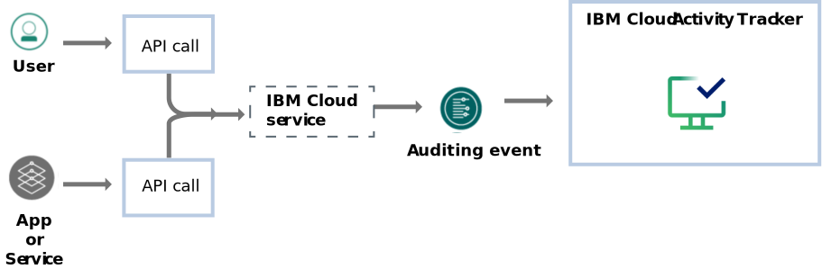

---

copyright:
  years: 2022, 2023, 2024
lastupdated: "2024-05-31"

keywords:

subcollection: atracker

---

{{site.data.keyword.attribute-definition-list}}

# Specifications
{: #atracker-resources}

Use {{site.data.keyword.atracker_full}} to configure how to route audit events, both [global](/docs/atracker?topic=atracker-event_types#event_types_global) and [location-based](/docs/atracker?topic=atracker-event_types#event_types_location) event data, in your {{site.data.keyword.cloud_notm}}. The events comply with the Cloud Auditing Data Federation (CADF) standard.
{: shortdesc}

{: caption="Figure 1. The {{site.data.keyword.atracker_short}} service" caption-side="bottom"}

## Configuring the account
{: #atracker-resources-config}

To configure {{site.data.keyword.atracker_short}} in your account, define where auditing events are routed and stored. You must configure 1 or more targets, and 1 or more routes. You must also configure the account settings.
- A target defines the resource where you can store auditing events.
- A route defines the rules that determine where auditing events are routed in your account.
- The account settings configuration defines information such as default targets where events are collected in the account, type of endpoints that are allowed to manage the configuration, and allowed locations to store the data in the account.

You can collect [global events](/docs/atracker?topic=atracker-event_types#event_types_global) and [location-based events](/docs/atracker?topic=atracker-event_types#event_types_location).
- Global events report on activity in your account that relate to data and resources that are generally synchronized across all regions.
- Location-based events report on activity in your account that is generated by IBM Cloud services that are hosted within an IBM data centre location, like US-South or US-East.

Per account, you can choose the region where events are collected.

## Account configuration settings
{: #atracker-resources-settings}

When you configure the {{site.data.keyword.atracker_short}} account settings, you can define any of the following information:
1. The location in your {{site.data.keyword.cloud_notm}} account where the {{site.data.keyword.atracker_short}} account configuration metadata is stored.

    By metadata, we refer to the target/route/settings data that is available across the account in any region.

    You can choose any of the supported locations where {{site.data.keyword.atracker_short}} is available. For more information, see [Locations](/docs/atracker?topic=atracker-regions).

    Take into account any corporate or industry compliance requirements such as Financial Services Validated locations, or EU-managed regions, and any data residency requirements.

2. The type of endpoints that are allowed to manage the {{site.data.keyword.atracker_short}} account configuration in the account.

    You can configure public endpoints, private endpoints, or both.

3. The locations where an account administrator can define targets to collect auditing events.

    You can choose any of the supported locations where {{site.data.keyword.atracker_short}} is available. For more information, see [Locations](/docs/atracker?topic=atracker-regions).

    Take into account any corporate or industry compliance requirements such as Financial Services Validated locations, or EU-managed regions, and any data residency requirements.

4. 1 or more targets in the account that will collect auditing events from supported {{site.data.keyword.atracker_short}} locations where you have not configured how you want to route the auditing events.

    If you define more than 1 target, all default targets get a copy of the auditing events that do not have a routing rule to indicate where to route them in the account. You can define up to 2 default targets per account.
    {: note}

When you configure or modify the {{site.data.keyword.atracker_short}} account settings, consider the following information:

- Every time you modify the {{site.data.keyword.atracker_short}} account settings, the data that is passed in the new request replaces any existing configuration data. You must ensure that any existing data is not deleted when you run an update of the account settings by including it in the new request.
{: important}

- Before you disable public endpoints by setting `--private-api-endpoint-only TRUE`, make sure your account has access to the private endpoint.  You can do this by running the command `ibmcloud account show`.  If `VRF Enabled` is `true` and `Service Endpoint Enabled` is `true` then you have access to the private endpoint.  If you do not have access to the private endpoint, you will be unable to re-enable the public endpoint since private endpoint access is required to re-enable the public endpoint.
{: important}

## Targets
{: #atracker-resources-targets}

A target defines where auditing events are collected.

Note the following information about targets:

* You can define up to 16 targets in each account.

* Each account can have up to 2 default targets. A default target defines a resource where auditing events that are not explicitly managed in the account's routing rules are sent.

* A target can be:

   * An {{site.data.keyword.cos_full_notm}} (COS) bucket

   * The {{site.data.keyword.atracker_short}} hosted event search offering

   * An {{site.data.keyword.messagehub_full}} topic

   * An {{site.data.keyword.logs_full_notm}} offering

* All targets can be accessed by any {{site.data.keyword.atracker_short}} API endpoint.

* Targets are created within a region but are visible across regions.

* You can define targets in the same account where events are generated or in a different account.

* When you define a Cloud Object Storage target, you can use an API key or service to service authentication to upload events.

* You can manage targets in your account by using the {{site.data.keyword.atracker_short}} CLI, and programmatically by using the {{site.data.keyword.atracker_short}} REST API and Terraform scripts.

* To manage targets, you need IAM permissions. For more information, see [IAM actions by task](/docs/atracker?topic=atracker-iam&interface=cli#platform).

The following table outlines valid target types:

| Target                                      | Type                     | More info |
|---------------------------------------------|--------------------------|-----------|
| {{site.data.keyword.cos_full_notm}} (COS) | `cloud_object_storage`   | [Managing COS targets](/docs/atracker?topic=atracker-target_v2_cos&interface=cli) |
| {{site.data.keyword.at_short}} | `logdna`   | [Managing {{site.data.keyword.at_short}} hosted event search targets](/docs/atracker?topic=atracker-target_v2_at&interface=cli) |
| {{site.data.keyword.messagehub_full}} | `event_streams`   | [Managing {{site.data.keyword.messagehub_full}} targets](/docs/atracker?topic=atracker-target_v2_ies&interface=cli) |
| {{site.data.keyword.logs_full_notm}} | `cloud_logs`   | [Managing Cloud Logs targets](/docs/atracker?topic=atracker-target_v2_icl&interface=cli) |
{: caption="Table 1. List of targets" caption-side="top"}

## Routes
{: #atracker-resources-routes}

A route defines the rules that indicate where auditing events that are generated in the account are routed.

* Routes are global under an account and are evaluated in all regions where {{site.data.keyword.atracker_short}} is deployed.

* Routes may be managed from any regional {{site.data.keyword.atracker_full}} API endpoint.

* You can define up to 30 routes for an account.

* By default, the account has 0 routes configured.

* You can configure up to 10 rules for each route. A routing rule indicates the locations and associated targets where auditing events are routed.

* You can configure up to 8 locations for each rule.

* You can configure up to 3 targets (`target_ids`) for each rule.

* Routes are processed independently.  If you have multiple routes with rules that match the same event, that event will be sent to multiple targets.

* Rules are processed in order.  The first matching rule (for example,  `location`) an event matches will be used to process the event.  Once an event has been processed it will not be processed by a subsequent rule within that route's definition. If you want to specify a default rule for all events that were not processed by other rules you would specify the rule (`"locations" : ["*"]`) as the final rule in your `rules` definition for the `route`.

* If an event doesn't match any rule and no default target is configured, the event will be dropped and not routed to any target.

* Any update to a `rules` configuration must include all `location` rules.  An update will discard the existing rule set and replace it with the specified configuration.

* You can manage routes in your account by using the {{site.data.keyword.atracker_short}} CLI, and programmatically by using the {{site.data.keyword.atracker_short}} REST API and Terraform scripts.

* To manage routes, you need IAM permissions. For more information, see [{{site.data.keyword.atracker_short}} actions](/docs/atracker?topic=atracker-iam&interface=cli#platform).

## Collecting auditing events
{: #atracker-resources-collect}

To collect auditing events in your {{site.data.keyword.cloud_notm}} account, you can configure {{site.data.keyword.atracker_short}} by using the {{site.data.keyword.atracker_short}} API, the {{site.data.keyword.atracker_short}} CLI and Terraform scripts.

For more in formation, see [Collecting events](/docs/atracker?topic=atracker-events_collect&interface=cli).
