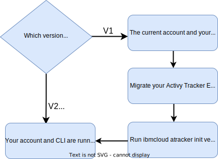

---

copyright:
  years: 2019, 2022
lastupdated: "2022-08-08"

keywords: 

subcollection: atracker

---

{{site.data.keyword.attribute-definition-list}}


# Configuring the CLI to manage the {{site.data.keyword.atracker_short}} account configuration
{: #atracker-cli-config}

You must configure your local {{site.data.keyword.atracker_short}} CLI so that you can manage the {{site.data.keyword.atracker_short}} account configuration by using CLI commands.
{: shortdesc}

To manage the {{site.data.keyword.atracker_short}} account configuration by using CLI commands, the version of the {{site.data.keyword.atracker_short}} CLI (`atracker`) must match the API version that was used to create the configuration resources. You can run the `ibmcloud atracker init version` command to initialize the CLI plugin to use the API version that was used to create the configuration resources in your account.

You must install the latest version of the {{site.data.keyword.atracker_full_notm}} CLI in order to pick up the latest CLI features including the commands to setup the V2 configuration and the migration of your V1 configuration if applicable. Once the {{site.data.keyword.atracker_full_notm}} account configuration has been migrated to V2, anyone using the `ibmcloud atracker` CLI to interact with the {{site.data.keyword.atracker_short}} CLI plugin will need to upgrade their CLI plugins in order to leverage the updated V2 APIs. Older client plugins will report errors.

## Step 1. Installing the {{site.data.keyword.atracker_short}} CLI
{: #atracker-cli-config-install}

Complete the following steps to install the {{site.data.keyword.atracker_short}} CLI:

1. [Install the {{site.data.keyword.cloud_notm}} CLI](/docs/cli?topic=cli-install-ibmcloud-cli).

2. Get the versions that are available for the `atracker` CLI plugin. Run the following command:

    ```text
    ibmcloud plugin repo-plugins
    ```
    {: pre}

    For example, to get the versions of the {{site.data.keyword.atracker_short}} CLI plugin, run the following command:

    ```text
    ibmcloud plugin repo-plugins | grep atracker
    ```
    {: pre}

    The output of the command will list the versions that are available. 

3. Install the CLI plugin in your local system. Run the following command:

    ```text
    ibmcloud plugin install atracker [-v VERSION]
    ```
    {: pre}

    Where `VERSION` is the value of a listed version that is available for the plugin.

    If you already have the {{site.data.keyword.atracker_short}} CLI plugin installed in your local system and you want to update the version of the plugin, run the following command: `ibmcloud plugin update atracker`.
   

If you want to delete the {{site.data.keyword.atracker_short}} CLI plugin from your local system, run the following command: `ibmcloud plugin delete atracker`.
{: tip}


## Step 2. Initializing the {{site.data.keyword.atracker_short}} CLI
{: #atracker-cli-config-init}

Initialize the CLI plugin in your local system to set the API version that the CLI plugin uses to manage the {{site.data.keyword.atracker_short}} account configuration. Use the `ibmcloud atracker init` command.

You must set the API version that the CLI plugin targets in your local system in any of the following scenarios:
- After you complete the migration of an {{site.data.keyword.atracker_short}} V1 configuration to V2. 
- After you have installed the CLI V2 plugin in your local system and you have an {{site.data.keyword.atracker_short}} V1 configuration configured in your account.

{: caption="Figure 1. Flowchart showing steps depending on your configuration version" caption-side="bottom"}

### What API version is targeted by the atracker CLI plugin
{: #atracker-cli-config-apiversion}

When you are logged in to an {{site.data.keyword.cloud_notm}} account from your local system, the API version that the `atracker` CLI plugin targets is set as follows:

- If your {{site.data.keyword.cloud_notm}} account is running an {{site.data.keyword.atracker_short}} V1 configuration and you have a CLI V1 plugin installed in your local system, the CLI plugin is set by default in your local system to use the API V1.

- If your {{site.data.keyword.cloud_notm}} account is running an {{site.data.keyword.atracker_short}} V1 configuration and you have a CLI V2 plugin installed in your local system, you must set the API version that the CLI plugin targets in your local system to V1 by running the `ibmcloud atracker init version` command. 

- If your {{site.data.keyword.cloud_notm}} account is running an {{site.data.keyword.atracker_short}} V2 configuration and you have a CLI V1 plugin installed in your local system, you must upgrade your local system by installing the CLI V2 plugin.

- If your {{site.data.keyword.cloud_notm}} account is running an {{site.data.keyword.atracker_short}} V2 configuration and you have a CLI V2 plugin installed in your local system, the CLI plugin is set by default in your local system to use the API V2.

- If you have a CLI V2 plugin installed in your local system and you migrate your account from an {{site.data.keyword.atracker_short}} V1 configuration to an {{site.data.keyword.atracker_short}} V2 configuration, you must set the API version that the CLI plugin targets in your local system to V2 by running the `ibmcloud atracker init version` command. 


### IAM permissions 
{: #atracker-cli-config-iam}

To run the `ibmcloud atracker init` command, you must have the following [IAM roles](/docs/account?topic=account-assign-access-resources): 

| Role                      | Minimum required roles | Action
| ------------------------- | ---------------------- | -------------- |
| `atracker.setting.get`    | `Administrator`  \n `Editor`  \n `Viewer`  \n `Operator` | Initialize the API version that the CLI plugin uses. |
{: caption="Table 1. Required IAM roles}


### Scenario 1: Before you migrate the {{site.data.keyword.atracker_short}} configuration
{: #atracker-cli-config-set-1}

If you have routes and targets already configured in your {{site.data.keyword.cloud_notm}} account when the V2 CLI is deployed to your local system, you must run the `ibmcloud atracker init version` command to revert your local system to use the V1 API until you have [migrated your routes and targets to a V2 configuration.](/docs/atracker?topic=atracker-migrate-resources) 
{: important}

Complete the following steps to set the CLI version to V1 so that you can manage an {{site.data.keyword.atracker_short}} V1 configuration with a CLI V2 plugin:

1. [Install {{site.data.keyword.atracker_full_notm}} CLI V2](/docs/atracker?topic=atracker-atracker-cli-config#atracker-cli-config-install).

2. Check the version of the plugin is set to a V2 version such as `0.2.x`.

    ```text
    ibmcloud plugin show --repo atracker
    ```
    {: pre}

3. Run the following command to set the CLI to use the API V1:

    ```text
    ibmcloud atracker init version
    ```
    {: pre}

    The plugin is set to V1.


### Scenario 2: After you migrate the {{site.data.keyword.atracker_short}} configuration
{: #atracker-cli-config-set-2}

When you migrate your account's {{site.data.keyword.atracker_short}} configuration from V1 to V2, complete the following steps to set the CLI version to V2:

1. Check the version of the plugin is set to a V2 version such as `0.2.x`.

    ```text
    ibmcloud plugin show --repo atracker
    ```
    {: pre}

2. Run the following command to set the CLI to use the API V2:

    ```text
    ibmcloud atracker init version
    ```
    {: pre}

    The plugin is set to V2.


