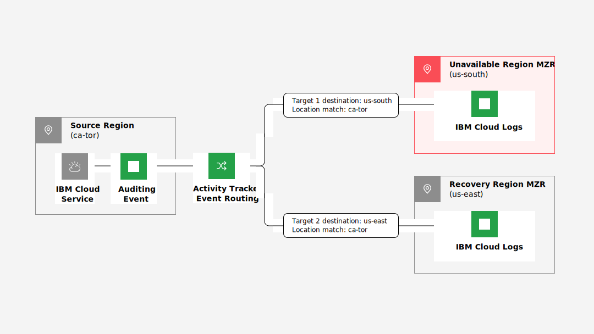

---

copyright:
  years:  2021, 2024
lastupdated: "2024-10-09"

keywords:

subcollection: atracker

---

{{site.data.keyword.attribute-definition-list}}

# Creating a routing configuration resilient to a regional disaster
{: #dr_config}

{{site.data.keyword.atracker_full_notm}} is a highly available, multi-tenant, regional service. However, you can also configure a routing configuration to a backup instance to mitigate data loss if a regional disaster occurs.
{: shortdesc}

For more information about {{site.data.keyword.atracker_full_notm}} availability and recovery that is provided by the service, see [High availability and disaster recovery](/docs/atracker?topic=atracker-ha_dr).
{: note}

## Understanding targets and routes
{: #dr_config_prereq}

Before creating a backup region, you need to understand targets and routes.

- Targets are created within a region but are global resources. For more information, see [Managing targets](/docs/atracker?topic=atracker-target_v2).

- Routes are global under an account and are evaluated in all regions where {{site.data.keyword.atracker_full_notm}} is deployed. For more information, see [Managing routes](/docs/atracker?topic=atracker-route_v2).

- The account settings configuration defines information such as default targets where events are collected in the account, types of endpoints that are allowed to manage the configuration, configuration metadata locations, and allowed locations to store the data in the account. For more information, see [Account configuration settings](/docs/atracker?topic=atracker-atracker-resources&interface=cli#atracker-resources-settings).

    If both the primary metadata region and the backup metadata region configured in the account settings are unavailable, no events will be routed.
    {: important}

## Routing to a backup target in a different region
{: #dr_config_backup}

You can configure a backup target for data that is routed by your {{site.data.keyword.atracker_full_notm}} instance to a target that is running in a different region. You can then route all data to both your primary and backup targets. Configuring a backup target gives you targets that are in sync. You can switch to the backup with no downtime and minimal data loss if a regional disaster occurs.

Creating a second target for backup purposes results in additional charges for running the backup target instance.
{: important}

{: caption="Example of a routing configuration that creates a backup of all auditing events to a second target in a different region" caption-side="bottom"}

In this example, the source of the auditing events is in the Toronto region (`ca-tor`). Auditing events from the {{site.data.keyword.cloud_notm}} service are sent by {{site.data.keyword.atracker_full_notm}} to an {{site.data.keyword.at_full_notm}} instance in Dallas (`us-south`). A regional disaster resilient routing configuration is created to route auditing events to an {{site.data.keyword.at_full_notm}} instance (Target 2) in the Washington region (`us-east`) as well. All events are sent to both the target in the Dallas region (`us-south`) and Washington region (`us-east`).

Target 2 provides the user with historical auditing events in the Washington region (`us-east`). If the Dallas region (`us-south`) is not available, users have Toronto (`ca-tor`) activity events available in the Washington region (`us-east`).

For users without a disaster resilient routing configuration, no historical auditing events are available in a second region.

For more information about configuring routes, see [Managing routes](/docs/atracker?topic=atracker-route_v2).

In addition, you must define a backup metadata region for your metadata backup. The backup metadata region must be a different region from your primary metadata region.

### Security considerations in an environment with two targets
{: #dr_config_sec}

When you configure an environment with a backup target, you need to consider the following:

* Context-based restrictions give account owners and administrators the ability to define and enforce access restrictions for {{site.data.keyword.cloud_notm}} resources based on a rule's criteria. The criteria includes the network location of access requests, the endpoint type from where the request is sent, and sometimes the API that the request tries to access. These restrictions work with traditional IAM policies, which are based on identity, to provide an additional layer of protection. For more information, see [What are context-based restrictions?](/docs/account?topic=account-context-restrictions-whatis)

   If context-based rules are configured in the account, make sure that the rules are defined for both the primary and backup locations. 

   You can configure context-based restrictions rules for {{site.data.keyword.at_full_notm}}, {{site.data.keyword.cos_full_notm}} (COS),{{site.data.keyword.logs_full_notm}}, and {{site.data.keyword.messagehub_full}} targets.

   For a full list of services supporting context-based restrictions, see [Services integrated with context-based restrictions](/docs/account?topic=account-context-restrictions-whatis#cbr-adopters).

* {{site.data.keyword.iamlong}} (IAM) enables you to securely control access to all cloud resources consistently in the {{site.data.keyword.cloud_notm}}. The IAM permissions and authorizations must allow the service to route events to both the primary and backup targets.

## Automatic disaster management
{: #dr_config_auto}

You can choose to allow {{site.data.keyword.atracker_full_notm}} to handle a regional disaster as described in [High availability and disaster recovery](/docs/atracker?topic=atracker-ha_dr).

In this case, no additional charges for a second [target instance](#dr_config_backup) are charged. However, you also have the following risks:

* No access is available to any historical data from the region that incurred the disaster.
* Data is lost while you configure a new instance while the existing instance is not available.
* Events routed to an {{site.data.keyword.at_full_notm}} target can be [archived](/docs/activity-tracker?topic=activity-tracker-archiving-ov). However, a delay of archived data is possible and the data is not guaranteed to be available for the prior 24 hours. For information about {{site.data.keyword.cos_full_notm}} (COS), see [{{site.data.keyword.cos_full_notm}}](/docs/cloud-object-storage).
* Any events that are routed to an {{site.data.keyword.logs_full_notm}} target can be [archived](/docs/cloud-logs?topic=cloud-logs-about-bucket). For more information, see [Understanding your responsibilities when you use {{site.data.keyword.logs_full_notm}}](/docs/cloud-logs?topic=cloud-logs-shared-responsibilities).
* Any events that are routed to an {{site.data.keyword.at_full_notm}} target that are then [streamed to an {{site.data.keyword.messagehub_full}} instance](/docs/activity-tracker?topic=activity-tracker-streaming-configure) are only maintained up to the buffer size for 24 hours. Data can then be lost. For more information, see [Understanding your responsibilities when you use Event Streams](/docs/EventStreams?topic=EventStreams-event_streams_responsibilities).
