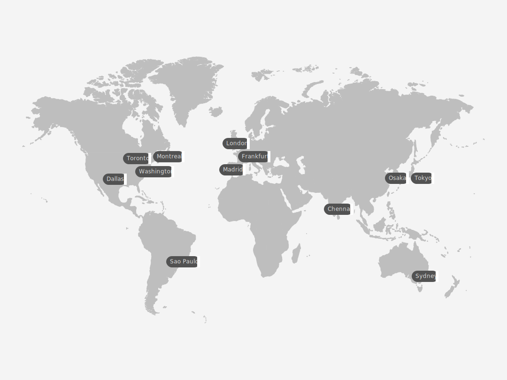

---

copyright:
  years:  2021, 2025
lastupdated: "2025-07-31"

keywords:

subcollection: atracker

---

{{site.data.keyword.attribute-definition-list}}

# Locations
{: #regions}

{{site.data.keyword.atracker_full}} is available in the following locations:
{: shortdesc}

{: caption="Displays the regions where you can create and manage {{site.data.keyword.atracker_short}} resources." caption-side="bottom"}

This image is an artistic representation and does not reflect actual political or geographic boundaries.
{: note}

| Geography             | Region                   | EU-Supported | HA Status |
|-----------------------|--------------------------|--------------|-----------|
| `Asia Pacific`        | `Chennai (in-che)`        | `N/A`        | `SZR`     |
| `Asia Pacific`        | `Osaka (jp-osa)`        | `N/A`        | `MZR`     |
| `Asia Pacific`        | `Sydney (au-syd)`        | `N/A`        | `MZR`     |
| `Asia Pacific`        | `Tokyo (jp-tok)`        | `N/A`        | `MZR`     |
| `Europe`              | `Frankfurt (eu-de) (*)`  | `YES`        | `MZR`     |
| `Europe`              | `London (eu-gb)`  | `NO`        | `MZR`     |
| `Europe`              | `Madrid (eu-es) (*)`  | `YES`        | `MZR`     |
| `North America`       | `Dallas (us-south)`      | `N/A`        | `MZR`     |
| `North America`       | `Montreal (ca-mon)`      | `N/A`        | `MZR`     |
| `North America`       | `Toronto (ca-tor)`      | `N/A`        | `MZR`     |
| `North America`       | `Washington (us-east)`   | `N/A`        | `MZR`     |
| `South America`       | `Sao Paulo (br-sao)`   | `N/A`        | `MZR`     |
{: caption="List of locations for {{site.data.keyword.atracker_short}}" caption-side="top"}

Where
* A *geography* is a geographic area or larger political body that contains one or more regions.
* A *region* is a defined geographic territory. A region could be a specific postal code area, a town, a city, a state, a group of states, or even a group of countries.
* `N/A` means feature that is not applicable to that geography.

`(*)` For more information, see [Enabling EU support for your account](/docs/account?topic=account-eu-supported).
