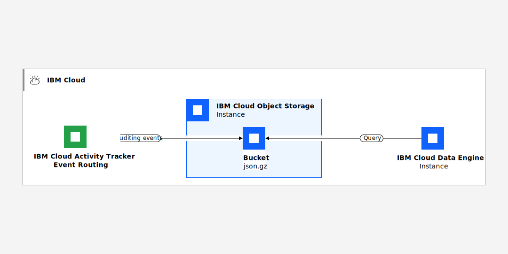

---

copyright:
  years: 2022, 2024
lastupdated: "2024-01-18"

keywords:

subcollection: atracker


---

{{site.data.keyword.attribute-definition-list}}


# Querying data by using the {{site.data.keyword.sqlquery_short}} service
{: #data-engine}

You can use the {{site.data.keyword.sqlquery_full}} service to query {{site.data.keyword.atracker_full_notm}} (AT) files that are stored in an {{site.data.keyword.cos_short}} (COS) bucket in your account. You can run queries from the {{site.data.keyword.cloud_notm}} UI, or programmatically.
{: shortdesc}


{: caption="Figure 1. Integration with {{site.data.keyword.sqlquery_notm}}" caption-side="bottom"}


To query the archive data in a file, you can use the {{site.data.keyword.sqlquery_short}} service. The service offers an SQL editor through the UI, and also programmatic options such as a REST API.

Use the [{{site.data.keyword.sqlquery_short}} user interface (UI)](/docs/sql-query?topic=sql-query-running) to develop and test your queries, and the [SQL Query REST API](/apidocs/sql-query/sql-query-v3) to automate them.
{: tip}

The {{site.data.keyword.sqlquery_short}} service provides a serverless, no-ETL solution to easily query data stored in {{site.data.keyword.cos_short}}. SQL Query uses Apache Spark SQL as its underlying query engine.


You can use {{site.data.keyword.sqlquery_short}} to run SQL queries (that is, `SELECT` statements) to analyze and transform structured and semi-structured data, or clean up rectangular data. You cannot run actions such as `CREATE`, `DELETE`, `INSERT`, and `UPDATE`.

The {{site.data.keyword.sqlquery_short}} service can process input data that is read from CSV, JSON, ORC, Parquet, or AVRO files. The archive files from an {{site.data.keyword.atracker_full_notm}} instance contain data in JSON format.

Query result can be written to a `CSV`, `JSON`, `ORC`, `PARQUET`, or `AVRO` file in a {{site.data.keyword.cos_short}} instance of your choice.


## Prerequisites
{: #data-engine-prereq}

Check the following prerequisites before you use the {{site.data.keyword.sqlquery_short}} service to query archived event files.

* You must have access to a COS instance in your account.

    You must have access to a bucket that contains the {{site.data.keyword.atracker_full_notm}} event files and a bucket to store results from your queries.

* You must have {{site.data.keyword.atracker_full_notm}} configured in your account.

    You must have a route that defines rules to send events to a {{site.data.keyword.cos_full_notm}} (COS) bucket.

    Events are streamed into the COS bucket.

* You must have a policy on the COS service with at least the **Reader** platform role so that you can view data in the COS bucket where the event files are uploaded.

* You must have a policy on the COS instance with at least **Writer** access to at least one COS bucket so that results can be written to that instance.


## Step 1. Provisioning a {{site.data.keyword.sqlquery_short}} instance
{: #data-engine-step1}

To query archive files stored in a COS bucket, you can use the {{site.data.keyword.sqlquery_short}} service.

You must provision the {{site.data.keyword.sqlquery_short}} service in the same account where the Cloud Object Storage instance that manages the bucket is located.
{: important}

To provision an instance, see [Create your {{site.data.keyword.sqlquery_short}} service instance](/docs/sql-query?topic=sql-query-getting-started).


After you have {{site.data.keyword.sqlquery_short}} running on {{site.data.keyword.cloud_notm}}, you can start querying your data by using the {{site.data.keyword.sqlquery_short}} UI, or programmatically by using either [the {{site.data.keyword.sqlquery_short}} REST API](/apidocs/sql-query/sql-query-v3), or the Python `ibmcloudsql` library.


## Step 2. Granting user permissions to run a query
{: #data-engine-step2}

To run queries with the SQL query service, a user needs a platform role and a service role. The following tables show the roles and actions that you can assign a user to run SQL queries:


| Platform actions                        | Administrator                                     | Editor | Operator | Viewer  |
|---------------------------------------------------------------------------|:-------------------------------------------------:|:-------:|:--------:|:------:|
| `View details of the {{site.data.keyword.sqlquery_short}} service instance`    |   |     |       |     |
{: caption="Table 1. Platform roles" caption-side="top"}


| Service actions                 | Manager                                           | Writer                                            | Reader           |
|:-------------------------------:|:-------------------------------------------------:|:-------------------------------------------------:|:----------------:|
| `Run an SQL query`              |  |  |                  |
{: caption="Table 2. Service roles" caption-side="top"}

Users with the service role **Reader** get an access error when they start the SQL Query UI.
{: note}

To manage access, or assign new access for users by using IAM policies, you must be:

* The account owner
* The administrator for all services in the account
* The administrator for the particular service or service instance.

Choose any of the following actions to manage IAM policies in the {{site.data.keyword.cloud_notm}}:

* To grant permissions to a user, see [Assigning access](/docs/account?topic=account-assign-access-resources#assign-new-access).
* To revoke permissions, see [Removing access](/docs/account?topic=account-assign-access-resources&interface=ui#removing-access-console).
* To review a user's permissions, see [Reviewing your assigned access](/docs/account?topic=account-assign-access-resources&interface=ui#review-your-access-console).


## Step 3. Running a query by using the {{site.data.keyword.sqlquery_short}} UI
{: #data-engine-step3}

In SQL, the term *query* is just another way of saying *SELECT statement*.

To run a query, do the following steps:

### Step 3.1. Launch the {{site.data.keyword.sqlquery_short}} query UI
{: #data-engine-step3_1}

1. [Log in to your {{site.data.keyword.cloud_notm}} account](https://cloud.ibm.com/login){: external}.

	After you log in with your user ID and password, the {{site.data.keyword.cloud_notm}} dashboard opens.

2. Click the **Menu** icon  &gt; **Resource list** &gt; **Services**.

3. Select an {{site.data.keyword.sqlquery_short}} instance.

4. From the *Manage* tab, select **Launch {{site.data.keyword.sqlquery_short}} UI**.

When the {{site.data.keyword.sqlquery_short}} query UI opens, a COS bucket is automatically generated. This bucket is used by default by the {{site.data.keyword.sqlquery_short}} service to store the results from your SQL queries.

When you run queries, you can specify a custom bucket to store results in. If your query does not specify one, the default one is used.
{: note}

### Step 3.2. Get information about the file that you want to query in COS
{: #data-engine-step3_2}

Complete the following steps:

1. In the {{site.data.keyword.cloud_notm}} dashboard, click the **Menu** icon  &gt; **Resource list** &gt; **Storage**.

2. Select the {{site.data.keyword.cos_short}} (COS) instance that has the bucket with the event files.

3. Select **Buckets**.

4. Select the bucket name. You can see the list of the files in the bucket.

5. Identify the file that you want to query.

    The file name has the date, in UTC format, of the events that are included in the file.
    {: note}

    If you see a file of `20 bytes`, that file does not contain any data.

6. For the file you want to query file, select **Access with Data Engine**.

    A window opens that shows the URL.

7. Copy the URL. Then, select **Open in Data Engine**.

### Step 3.3. Get information about the COS bucket that is used to store query results
{: #data-engine-step3_3}

Complete the following steps:

1. In the COS instance UI, select **Buckets**.

2. Select the bucket name that you plan to use to store the results from the queries.

3. For that bucket, select **Access with Data Engine**.

    A window opens displaying the URL.

4. Copy the URL.


## Step 4. Query the data
{: #data-engine-step4}

Select data by running the following query on the files that are generated by the {{site.data.keyword.atracker_full_notm}} service:

```text
SELECT * FROM cos://<BUCKET_REGION>/<SOURCE_BUCKET_NAME>/<ACTIVITY_TRACKER_EVENTS_REGION>/<DATE(YYYY-MM-DD)>T<HOUR>:<MINUTES>/* STORED AS JSON LIMIT 50
INTO cos://<RESULTS_BUCKET_REGION>/<RESULTS_BUCKET_NAME>/result/ STORED AS JSON
```
{: codeblock}


Where:

`BUCKET_REGION`
:   Is the {{site.data.keyword.cloud_notm}} region where the {{site.data.keyword.cos_full_notm}} (COS) bucket containing the events is located.

`SOURCE_BUCKET_NAME`
:   Is the name of the COS bucket containing the events.

`ACTIVITY_TRACKER_EVENTS_REGION`
:   Is the {{site.data.keyword.cloud_notm}} region where the events originated.

`<DATE(YYYY-MM-DD)>T<HOUR>:<MINUTES>`
:   Is the timestamp of the events to be extracted and stored in the results.

`RESULTS_BUCKET_REGION`
:   Is the {{site.data.keyword.cloud_notm}} region where the {{site.data.keyword.cos_full_notm}} (COS) bucket containing the query results are stored.

`RESULTS_BUCKET_NAME`
:   Is the name of the COS bucket where the query results are stored.

### Query selected fields
{: #data-engine-step4-1}

To query selected fields, you can run the following query:

```text
SELECT *,
  get_json_object(line, '$.eventTime') AS eventTime,
  get_json_object(line, '$.action') AS action,
  get_json_object(line, '$.message') AS message,
  get_json_object(line, '$.initiator.name') AS initiatorName
FROM cos://<BUCKET_REGION>/<BUCKET_NAME>/<ACTIVITY_TRACKER_EVENTS_REGION>/<DATE(YYYY-MM-DD)>T<HOUR>:<MINUTES>/* STORED AS JSON
INTO cos://<RESULTS_BUCKET_REGION>/<RESULTS_BUCKET_NAME>/result/ STORED AS JSON
```
{: codeblock}


### Query user management events
{: #data-engine-step4-2}

To query activities related to user management in the account, you can run a query similar to the following:

```text
SELECT *
FROM (
  SELECT *,
    get_json_object(line, '$.action') AS action
  FROM cos://<BUCKET_REGION>/<BUCKET_NAME>/<ACTIVITY_TRACKER_EVENTS_REGION>/<DATE(YYYY-MM-DD)>T<HOUR>:<MINUTES>/*  STORED AS JSON
)
WHERE action IN ("user-management.user.create", "user-management.user-invitation.accept", "user-management.user.update", "user-management.user.delete", "user-management.user-setting.update")
LIMIT 50
INTO cos://<BUCKET_REGION>/<RESULTS_BUCKET>/result/ STORED AS JSON
```
{: codeblock}


### Query IAM events
{: #data-engine-step4-3}


For example, to query activities related to access groups, trusted profiles or policies in the account, you can run the following query:

```text
SELECT *
FROM (
  SELECT *,
    get_json_object(line, '$.action') AS action
  FROM cos://<BUCKET_REGION>/<BUCKET_NAME>/<ACTIVITY_TRACKER_EVENTS_REGION>/<DATE(YYYY-MM-DD)>T<HOUR>:<MINUTES>/*  STORED AS JSON
)
WHERE action IN ("iam-groups.group.create","iam-groups.group.delete","iam-groups.group.update","iam-identity.account-profile.create","iam-identity.account-profile.delete","iam-identity.account-profile.update","iam-am.policy.create","iam-am.policy.delete","iam-am.policy.update")
LIMIT 50
INTO cos://<BUCKET_REGION>/<RESULTS_BUCKET>/result/ STORED AS JSON
```
{: codeblock}


## Step 5. Query the data by year, month, day, or hour
{: #data-engine-step5}


You might need to query data by year, month, day.


### Query data for a specific day and hour
{: #data-engine-step5-1}

For example, to query events on 4 May 2023 at 9:50 AM, you can run the following query:

 ```text
 SELECT * FROM cos://<BUCKET_REGION>/<BUCKET_NAME>/<ACTIVITY_TRACKER_EVENTS_REGION>/2023-05-04T09:50/* STORED AS JSON LIMIT 50
INTO cos://us-south/sql-779ea735-850b-475a-8378-e9abce2ac6e9/result/ STORED AS JSON
```
{: codeblock}

You can only query for filenames which have a common prefix.
{: note}

### Query data for a specific day
{: #data-engine-step5-2}

To query events occurring on 4 May 2023 at any time during that day, you can run the following query:

 ```text
 SELECT * FROM cos://<BUCKET_REGION>/<BUCKET_NAME>/<ACTIVITY_TRACKER_EVENTS_REGION>/2023-05-04/* STORED AS JSON LIMIT 50
INTO cos://us-south/sql-779ea735-850b-475a-8378-e9abce2ac6e9/result/ STORED AS JSON
```
{: codeblock}

You can only query for filenames which have a common prefix.
{: note}


### Query data by year, month, day, or hour
{: #data-engine-step5-3}

To query more flexibly and efficiently data by year, month, day, or hour, consider preparing the data by running a query where you include `PARTITIONED BY (_year, _month, _day, _hour)`. The result of this query is structured data. The data in written into the COS bucket where you store results as follows: `cos://<region>/<bucket>/result/_year=yyyy/_month=MM/_day=dd/_hour=hh`

```text
SELECT *,
  get_json_object(line, '$.eventTime') AS eventTime,
  get_json_object(line, '$.action') AS action,
  get_json_object(line, '$.message') AS message,
  get_json_object(line, '$.initiator.name') AS initiatorName,
  year(get_json_object(line, '$.eventTime')) AS _year,
  month(get_json_object(line, '$.eventTime')) AS _month,
  day(get_json_object(line, '$.eventTime')) AS _day,
  hour(get_json_object(line, '$.eventTime')) AS _hour
FROM cos://<BUCKET_REGION>/<BUCKET_NAME>/<ACTIVITY_TRACKER_EVENTS_REGION>/<DATE(YYYY-MM-DD)>T<HOUR>:<MINUTES>/* STORED AS JSON
INTO cos://<RESULTS_BUCKET_REGION>/<RESULTS_BUCKET_NAME>/result/ STORED AS JSON
PARTITIONED BY (_year, _month, _day, _hour)
```
{: codeblock}

You can then use any of the fields selected in the query that prepare the data including the `_year` , `_month` as a column in the `WHERE` clause. For example, you can add the following `WHERE _year = 2023` clause to search for data in 2023.
