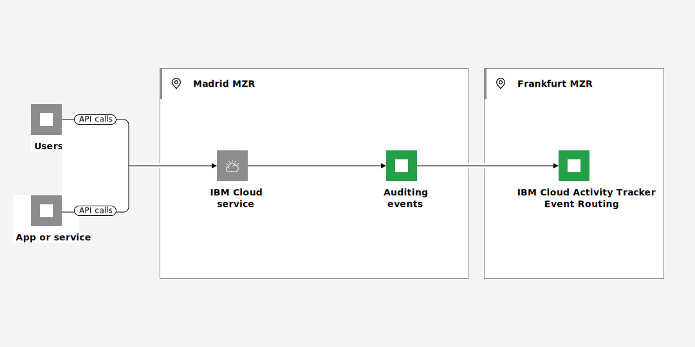

---

copyright:
  years:  2021, 2025
lastupdated: "2025-04-10"

keywords: Observability

subcollection: atracker

---

{{site.data.keyword.attribute-definition-list}}

# Working with events in a region where {{site.data.keyword.atracker_full_notm}} is not available
{: #manage-events-for-new-region}

In {{site.data.keyword.cloud_notm}}, auditing events that are generated by {{site.data.keyword.cloud_notm}} services in a region, location, or datacenter where the {{site.data.keyword.atracker_full_notm}} service is not available are managed through a different region.
{: shortdesc}

There are different scenarios that can trigger this situation:
- A new region opens a new [MZR](/docs/overview?topic=overview-locations) for business in {{site.data.keyword.cloud_notm}}. For example, Madrid region has recently open for business in June 2023. However, {{site.data.keyword.atracker_full_notm}} availability is planned for a later date.

- {{site.data.keyword.atracker_full_notm}} is not available in all the regions, locations, or datacenters where an {{site.data.keyword.cloud_notm}} service is. For example, you can provision classic infrastructure resources in the San Jose datacenter, and monitor auditing events through the US-South region where {{site.data.keyword.atracker_short}} is available.

In any of these situations, you can monitor activity in your account for DevOps, for compliance, or both. Services that generate auditing events are configured to send them to a different region where the {{site.data.keyword.atracker_full_notm}} service is available. You can monitor what is happening in the {{site.data.keyword.cloud_notm}} at all times for that service.

{: caption="Auditing events flow that are generated by {{site.data.keyword.cloud_notm}} services in a region, location, or datacenter where the {{site.data.keyword.atracker_full_notm}} service is not available are managed through a different region" caption-side="bottom"}

## Understanding auditing events
{: #manage-events-for-new-region-events}

{{site.data.keyword.atracker_full_notm}} provides the ability to collect auditing events for enabled {{site.data.keyword.cloud_notm}} services.  Some services might require a service plan upgrade or configuration setting changes to enable event tracking. Auditing events can help you investigate abnormal activity and critical actions.

There are two types of events:

Location-based
:   Location-based events are events that are associated with services running in a particular {{site.data.keyword.cloud_notm}} region.

Global
:   Global events are events generated by services that provide services for {{site.data.keyword.cloud_notm}} as a whole. An example of a service that generates global events is {{site.data.keyword.iamlong}}.

Events are routed based on a field value included in the event. You can define a set of routes, targets, and rules to determine where the events will be sent and stored. Events can be routed to an {{site.data.keyword.cos_full_notm}} bucket, an {{site.data.keyword.logs_full_notm}} instance, or {{site.data.keyword.messagehub_full}}.

For compliance purposes you might have to maintain your data within a particular country or region.
{: important}

Each {{site.data.keyword.cloud_notm}} service documents the {{site.data.keyword.atracker_full_notm}} events that it collects.  See [{{site.data.keyword.atracker_full_notm}} events](/docs/atracker?topic=atracker-cloud_services_atracker) for information on the services sending events and the events that are sent.

## How can you identify data from the Madrid location?
{: #manage-events-for-new-region-identify-events}

Auditing events include the field `logSourceCRN` that specifies the region, location, or datacenter where the resource is available. For example, for Madrid, you can see the location of events set to `eu-es`.

## Services that operate in non-supported {{site.data.keyword.atracker_short}} regions
{: #manage-events-for-new-region-locations-2}

The following list outlines services that operate in non-supported {{site.data.keyword.atracker_short}} regions and generate auditing events:
- [{{site.data.keyword.BluVirtServers_full}} (Classic)](/docs/virtual-servers?topic=virtual-servers-about-virtual-servers)
- [{{site.data.keyword.baremetal_long}} (Classic)](/docs/bare-metal?topic=bare-metal-about-bm#about-bm)
