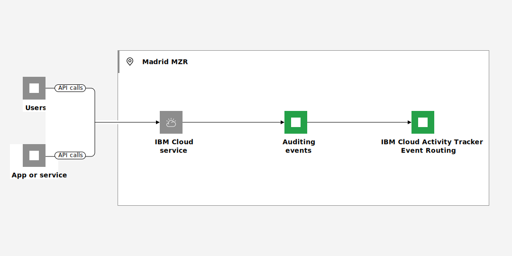

---

copyright:
  years: 2019, 2023, 2024
lastupdated: "2024-05-31"

keywords: Observability

subcollection: atracker

---

{{site.data.keyword.attribute-definition-list}}


# Managing events in a new location after {{site.data.keyword.at_short}} is available
{: #manage-events-to-new-region}

You must take action to manage events from {{site.data.keyword.cloud_notm}} services that generate auditing events in a new region where the {{site.data.keyword.atracker_full_notm}} service is not available until a later date.
{: shortdesc}

For example, the Madrid region opened for business in June 2023. {{site.data.keyword.cloud_notm}} services that are available and generate auditing events send currently those events to the Frankfurt region. You can manage and monitor interaction with these services in Frankfurt. Auditing events include the field `logSourceCRN` that specifies the region, location, or datacenter where the resource is available. For example, for Madrid, you can see the location of auditing events set to `eu-es`.


## Step 1. Prepare
{: #manage-events-to-new-region-1}

You cannot control when an {{site.data.keyword.cloud_notm}} service makes the switch of sending auditing events from one region to another one. However, you can add a new rule for Madrid to prepare for that switch.

Data is not sent to both locations, so you must take action before that switch is done by a service to mitigate any loss of data.
{: important}

{: caption="Figure 1. Flow of events in a single region" caption-side="bottom"}

Consider the following to plan for the switch over:

* Is {{site.data.keyword.atracker_full_notm}} [available in the new region](/docs/atracker?topic=atracker-regions)?
* Do you have any rules defined to route events for Madrid? Do you need to define new targets in Madrid to route those events to them?

## Step 2. Configure targets in Madrid
{: #manage-events-to-new-region-2}

A target defines where auditing events are collected. For more information about targets, see [Understanding how targets work in your account](/docs/atracker?topic=atracker-target_v2&interface=cli#target_v2_behavior).

Choose 1 of the following options to configure a target in Madrid in your account:
- [Configuring a Cloud Object Storage target](/docs/atracker?topic=atracker-getting-started-target-cos).
- [Configuring a {{site.data.keyword.at_short}} hosted event search target](/docs/atracker?topic=atracker-getting-started-target-logdna).
- [Configuring an {{site.data.keyword.messagehub}} target](/docs/atracker?topic=atracker-getting-started-target-event-streams).
- [Configuring an {{site.data.keyword.logs_full_notm}} target](/docs/atracker?topic=atracker-getting-started-target-cloud-logs).


## Step 3. Configure or modify a route to include a rule for Madrid
{: #manage-events-to-new-region-3}


A route defines the rules that indicate where auditing events that are generated in an account are routed. Routes are global under an account and are evaluated in all regions where {{site.data.keyword.atracker_short}} is deployed. For more information, see [Understanding how routes work in your account](/docs/atracker?topic=atracker-route_v2&interface=cli#route_behaviour).

For example, in this step, you will reconfigure a route to redirect events that are generated in Madrid to a target bucket.

Run the following command to create the route:

```text
ibmcloud atracker route update --route <ROUTE_NAME> --rules
```
{: pre}

Where

`--route <ROUTE_NAME>`
:   The name of the route.

`--rules <ROUTING_RULES>`
:   A JSON formatted rule definition enclosed in single quotes. You must keep existing rules and add new rules for Madrid. For example:

    ```json
    --rules '[{"locations":["global"],"target_ids":["11111111-1111-1111-1111-111111111111"]},{"locations":["us-south","us-east"],"target_ids":["22222222-2222-2222-2222-222222222222"]},{"locations":["eu-es"],"target_ids":["ID-OF-NEW-TARGET"]}]'
    ```
    {: codeblock}

After you configure a route, it might take up to 1 hour for the configuration to be enabled.
{: note}

For example, to create a route to send auditing events to a target that you created in the previous step, run the following command.

```text
ibmcloud atracker route create --name "my-route" --rules '[{"locations":["eu-es"],"target_ids":["TARGETID"]}]'
```
{: pre}

Where `TARGETID` is the ID of the target that you created in the previous step.
