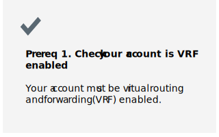
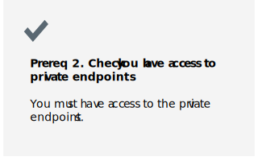

---

copyright:
  years: 2019, 2023
lastupdated: "2022-05-16"

keywords:

subcollection: atracker

content-type: tutorial
services: activity-tracker
account-plan: lite
completion-time: 1h

---

{{site.data.keyword.attribute-definition-list}}


# Configuring {{site.data.keyword.atracker_short}} by using the V1 API
{: #getting-started-routing}
{: toc-content-type="tutorial"}
{: toc-services="activity-tracker"}
{: toc-completion-time="1h"}


Use {{site.data.keyword.atracker_short}} to collect auditing events that are generated by services in your {{site.data.keyword.cloud_notm}} account. The events comply with the Cloud Auditing Data Federation (CADF) standard.
{: shortdesc}

{: caption="The {{site.data.keyword.atracker_full_notm}} service" caption-side="bottom"}

To configure {{site.data.keyword.atracker_short}} in your account to collect auditing events, you must configure {{site.data.keyword.atracker_short}} for each [supported region](/docs/atracker?topic=atracker-regions&interface=cli#regions-atracker) where you operate in {{site.data.keyword.cloud_notm}}. You must define a target and a route.
- A target is a resource where you can collect auditing events.

    Valid targets are a bucket in Cloud Object Storage, or an {{site.data.keyword.atracker_short}} instance.

    When the target is a bucket in Cloud Object Storage, you can define the target in the same account or in a different account.

    When the target is an {{site.data.keyword.atracker_short}} instance, the instance must be provisioned in the same account where auditing events are collected.

- A route defines the rules that determine where auditing events are collected in your account.

You can collect [global events](/docs/atracker?topic=atracker-event_types#event_types_global) and [location-based events](/docs/atracker?topic=atracker-event_types#event_types_location).
- Global events report on activity in your account that relate to data and resources that are generally synchronized across all regions.
- Location-based events report on activity in your account that is generated by IBM Cloud services that are hosted within an IBM data centre location, like US-South or US-East.

Per account, you can choose the region where global events are collected.

To configure {{site.data.keyword.atracker_short}}, you must use the [{{site.data.keyword.atracker_short}} REST API](https://test.cloud.ibm.com/apidocs/atracker){: external}. You can also use it with the golang language to define, retrieve, and modify routing targets and routes.

## Prerequisites
{: #getting-started-routing-prereqs}

If you are using public endpoints, these prerequisites are not required.
{: note}

If you want to restrict {{site.data.keyword.atracker_short}} in your account to only use private endpoints, make sure you check the following prerequisites:

[](#getting-started-routing-prereq-1) [](#getting-started-routing-prereq-2)

If you are using public endpoints, these prerequisites are not required.

This tutorial uses the {{site.data.keyword.atracker_full}} v1 API.
{: note}


### Prereq 1. Check your account is VRF enabled
{: #getting-started-routing-prereq-1}

{{site.data.keyword.atracker_short}} is a feature that requires the account to be virtual routing and forwarding (VRF) enabled.
{: important}

* When using the classic infrastructure, you connect to resources in your account over the {{site.data.keyword.cloud_notm}} public network by default. You can enable virtual routing and forwarding (VRF) to move IP routing for your account and all of its resources into a separate routing table. If VRF is enabled, you can then enable {{site.data.keyword.cloud_notm}} service endpoints to connect directly to resources without using the public network. [Enabling VRF and service endpoints](/docs/account?topic=account-vrf-service-endpoint).

* Virtual Private Clouds (VPCs) are automatically enabled for virtual routing and forwarding (VRF). To enable service endpoints for your VPC, continue to [Enabling service endpoints](/docs/account?topic=account-vrf-service-endpoint#service-endpoint).


To check if the account is VRF enabled, run the following command:

```text
ibmcloud account show
```
{: pre}

To enable private endpoints, run the following command:

```text
ibmcloud account update --service-endpoint-enable true
```
{: pre}

### Prereq 2. Check you have access to private endpoints
{: #getting-started-routing-prereq-2}

If you want to use private endpoints, you must configure {{site.data.keyword.atracker_short}} within the private network.

For example, to configure {{site.data.keyword.atracker_short}} in your account, you can provision a VPC VSI. Then, from a terminal, you can run cURL commands to create a target and a route.

Complete the following steps to provision a VPC VSI so that you can run cURL commands to create a target and a route in your account:

1. [Generate an ssh key](/docs/vpc?topic=vpc-ssh-keys).

2. [Create a VSI](https://test.cloud.ibm.com/docs/vpc?topic=vpc-creating-virtual-servers) in your account.

3. [Connect to the VSI](https://test.cloud.ibm.com/docs/vpc?topic=vpc-vsi_is_connecting_linux) from a terminal in your local environment.

4. After you ssh into the VSI, [install the IBM Cloud CLI](https://cloud.ibm.com/docs/cli?topic=cli-install-ibmcloud-cli). Run the following command:

    ```shell
    curl -fsSL https://clis.cloud.ibm.com/install/linux | sh
    ```
    {: pre}

You can run the following command to check that you can access the private endpoints:

```text
ping private.{region}.atracker.cloud.ibm.com
```
{: pre}

For example, you can run the following command to check access to the Dallas region:

```text
ping private.us-south.atracker.cloud.ibm.com
```
{: screen}


## Check your IAM permissions to work with {{site.data.keyword.atracker_short}}
{: #getting-started-routing-step1}
{: step}

**Every user that manages {{site.data.keyword.atracker_short}} configurations in your account must be assigned an access policy.** The policy determines what actions the user can perform. The allowable actions are customized and defined by {{site.data.keyword.atracker_short}} as operations that are allowed to be performed on the service. The actions are then mapped to IAM user roles. [Learn more](/docs/atracker?topic=atracker-iam).

Your user ID needs **account management permissions** to manage {{site.data.keyword.atracker_short}} configurations in the account. You need the **administrator** role for the {{site.data.keyword.atracker_short}} service. You might need to contact the account administrator to get permissions to work with {{site.data.keyword.atracker_short}}. The account owner can grant another user access to the account for the purposes of managing user access, and managing account resources. [Learn more](/docs/account?topic=account-account-services).

Choose one of the following options to grant your user permissions:
- [Using the console to assign access](/docs/account?topic=account-account-services#console-acct-mgmt)
- [Using the CLI to assign access](/docs/account?topic=account-account-services#using-the-cli-to-assign-access)
- [Using the API to assign access](/docs/account?topic=account-account-services#api-acct-mgmt).

Use the **serviceName** `atracker`.


## Configure a COS bucket
{: #getting-started-routing-step2}
{: step}

Auditing events that are collected in your account can be stored in {{site.data.keyword.cos_full_notm}} (COS) buckets.

When you configure {{site.data.keyword.atracker_short}}, you must define a target per region. The target defines the COS bucket where auditing events in that region are collected.

Before you create a bucket, consider the following information:
- You can create the bucket in any location.
- You can only configure 1 bucket per target.
- You must not share a bucket to collect [location-based auditing events](/docs/atracker?topic=atracker-event_types#event_types_location) from multiple regions.
- If you have regulatory and compliance requirements, check the locations where you can create a bucket. Then, if performance is critical, consider creating the COS bucket in the same region where the auditing events are generated.

For more information, see [Managing {{site.data.keyword.cos_full_notm}} (COS) buckets](/docs/atracker?topic=atracker-cos).

Use dedicated buckets for each region.
{: important}

Choose one of the following options to create a bucket:

| Action             | More info |
|--------------------|-----------|
| Create a bucket through the {{site.data.keyword.cloud_notm}} UI | [Learn more](/docs/atracker?topic=atracker-cos#cos_create_bucket_ui) |
| Create a bucket through the {{site.data.keyword.cloud_notm}} CLI | [Learn more](/docs/cloud-object-storage?topic=cloud-object-storage-cli-plugin-ic-cos-cli#ic-create-bucket) |
| Create a bucket by using cURL | [Learn more](/docs/cloud-object-storage?topic=cloud-object-storage-curl#curl-add-bucket) |
| Create a bucket by using the REST API | [Learn more](/docs/cloud-object-storage?topic=cloud-object-storage-compatibility-api-bucket-operations#compatibility-api-new-bucket) |
| Create a bucket with a different storage class by using the REST API| [Learn more](/docs/cloud-object-storage?topic=cloud-object-storage-compatibility-api-bucket-operations#compatibility-api-storage-class) |
| Create a bucket with Key Protect or Hyper Protect Crypto Services managed encryption keys (SSE-KP) by using the REST API | [Learn more](/docs/cloud-object-storage?topic=cloud-object-storage-compatibility-api-bucket-operations#compatibility-api-key-protect) |
| Create a bucket by using Terraform | [Learn more](/docs/ibm-cloud-provider-for-terraform?topic=ibm-cloud-provider-for-terraform-object-storage-resources) |
{: caption="Table 1. Create bucket requests" caption-side="top"}


## Configuring service-to-service authorization
{: #getting-started-routing-step3}
{: step}

Configure service-to-service authorization to your COS bucket so you do not need to pass an API key when writing your encrypted data to the COS bucket.

1. [Log in to your {{site.data.keyword.cloud_notm}} account](https://cloud.ibm.com/login){: external} as the account owner that will be configuring {{site.data.keyword.atracker_full_notm}} targets.

	After you log in with your user ID and password, the {{site.data.keyword.cloud_notm}} dashboard opens.

2. Click **Manage** &gt; **Access (IAM)**.  **Manage access and users** is displayed.

3. Click **Authorizations**.

4. Click **Create**.

5. For **Source service** select *Activity Tracker Event Routing* and for **How do you want to scope the access?** select *All resources*.

6. For **Target service** select *Cloud Object Storage* for **How do you want to scope the access?** select *Resources based on selected attributes*.

7. Select **Service instance** and **string equals** the name of your COS instance.

8. For **Service access** select **Object writer**.

9. Click **Authorize**.  Your new service-to-service authorization will be listed in the **Manage authorizations** view.

Alternately, you can create the service-to-service policy by running the following command:

```text
ibmcloud iam authorization-policy-create atracker cloud-object-storage "Object Writer"
```
{: pre}

You will only be able to authorize to the {{site.data.keyword.cos_full_notm}} instance using the UI. If you want to limit authorization to a specific {{site.data.keyword.cos_full_notm}} bucket, you need to configure authorization using the [API](/docs/atracker?topic=atracker-target_v2_cos&interface=cli#cos_s2s_api).
{: important}

## Initialize the {{site.data.keyword.atracker_short}} metadata location
{: #getting-started-routing-step4}
{: step}

Run the following command:

```text
ibmcloud atracker setting get
```
{: pre}

This will help you determine if your account is ready for the next steps.

* If you receive an error that the `setting` command is not valid, you need to update to the latest CLI by running the following command:

   ```text
   ibmcloud plugin install atracker
   ```
   {: pre}

* If the results show that `metadata_region_primary` has not been set, run the following command to set the region where your {{site.data.keyword.atracker_short}} metadata will be stored:

   ```text
   ibmcloud atracker setting update --metadata-region-primary REGION
   ```
   {: pre}

   Where REGION is your desired region, for example, US-South.

* If the `API version` returned from the `setting command` is `1`, complete the [migration to the V2 API](/docs/atracker?topic=atracker-migrate-resources) before continuing.

## Define a target
{: #getting-started-routing-step5}
{: step}

After you create the bucket, you can configure a target. The target defines the COS bucket where auditing events will be published.  The region identifies the location from which the writing to the bucket will occur.  If you want events from all regions to flow to this one COS bucket, then you only require a single target to be defined.

[Create a target](/docs/atracker?topic=atracker-target_v2_cos&interface=cli#target-create-cli-cos) by running the following command:

```text
ibmcloud atracker target create --name <TARGET_NAME> --type cloud-object-storage --endpoint <COS_ENDPOINT> --target-crn <COS_TARGET_CRN> --bucket <BUCKET> --region <REGION> --service-to-service-enabled true
```
{: pre}

Where

`--region <REGION>`
:   Name of the region that will process the events, for example, `us-south` or `eu-gb`. If not specified, the region logged into, or targeted, will be used.

`--name <TARGET_NAME>`
:   The name to be given to the target.

`--endpoint <COS_ENDPOINT>`
:   The {{site.data.keyword.cos_full_notm}} endpoint to be associated with the {{site.data.keyword.cos_full_notm}} bucket.

`--bucket <BUCKET>`
:    The name of the {{site.data.keyword.cos_full_notm}} bucket to be associated with the target.

`--target-crn <COS_TARGET_CRN>`
:   The CRN of the {{site.data.keyword.cos_full_notm}} instance.

`--service-to-service-enabled`
:   Indicates if [service-to-service authorization](#getting-started-routing-step3) has been enabled for the bucket.  Specify `TRUE` if service-to-service authorization is enabled and `FALSE` if service-to-service authorization is not enable.

For example, to create a target in the US-South region, you can run the following command:

```text
ibmcloud atracker target create --name  "My target" --type cloud-object-storage --endpoint "s3.private.us-south.cloud-object-storage.appdomain.cloud" --target-crn "crn:v1:bluemix:public:cloud-object-storage:global:a/<AccountID>:<COSinstanceID>::" --bucket "activity-tracking-bucket-us-south" --region "us-south" --service-to-service-enabled true
```
{: pre}

To see the target definition in a region, see [Getting information about a target using the CLI](/docs/atracker?topic=atracker-target_v2_cos&interface=cli#target-get-cli-cos).

When your target is created the target ID is returned. Make note of the target ID. You will need the target ID in the next step.
{: note}

## Define a route
{: #getting-started-routing-step6}
{: step}

After you have configured the target in a region, you must configure the route to specify the rules that define which auditing events are collected in a region and where to store them.

In this step you will configure a route to redirect all regional and global events to the target bucket configured in the previous step.

Run the following command to create the route:

```text
ibmcloud atracker route create --name <ROUTE_NAME> --target-ids <TARGET_ID>
```
{: pre}

Where

`--name <ROUTE_NAME>`
:   The name to be given to the route.

`--target <TARGET_ID>`
:   The target ID returned in the previous step.

For example, to create a route to send auditing events to the target created in the previous step, run the following command.

```text
ibmcloud atracker route create --name "my-route" --target-ids "281f78a2-d83f-430a-905e-e896f03cb403"
```
{: pre}

## Verify collection of events
{: #getting-started-routing-step7}
{: step}

After the target and the route is configured, you must verify that auditing events are available in your bucket.

Auditing events are stored in log files in the bucket.

Log files are structured and named as follows:

```text
<REGION>/<DATE>T<HOUR>/2021-02-23T15:38+05.log
```
{: codeblock}

Where

- `<REGION>` defines the region from where auditing events are collected. For example, valid values are `us-south` and `us-east`.
- `<DATE>` defines the date when auditing events are collected. The format is `YYYY-MM-DD`.
- `<HOUR>` defines the hour of the day. The value is set by using a 24-hour clock.
- `<FILENAME>` defines a timestamp. The format is `YYYY-MM-DDTHH:MM+SS`.

Each log file includes auditing events that have an `eventTime` that maps the filename timestamp. `eventTime` indicates when the auditing event was generated.

For example, a sample log file that collects auditing events in the US-South region looks as follows:

```text
us-south/2021-02-23T15/2021-02-23T15:38+05.log
```
{: screen}


You can choose any of the following methods to list objects in a bucket:
- [List objects in a given bucket by using the CLI](/docs/cloud-object-storage-cli-plugin?topic=cloud-object-storage-cli-plugin-ic-cos-cli#ic-list-objects).
- [List objects in a given bucket by using the API](/docs/cloud-object-storage?topic=cloud-object-storage-compatibility-api-bucket-operations#compatibility-api-list-objects-v2)
- [List objects in a given bucket through the {{site.data.keyword.cloud_notm}} UI](/docs/atracker?topic=atracker-cos#cos_bucket_list_objects_ui).
