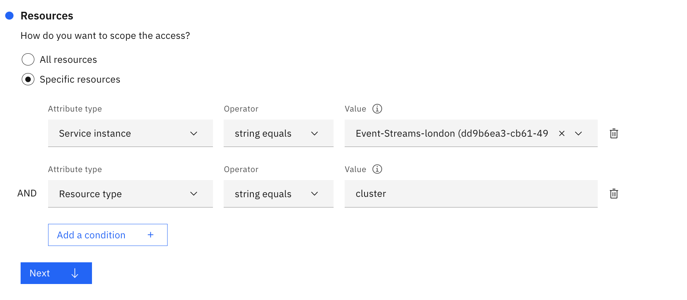
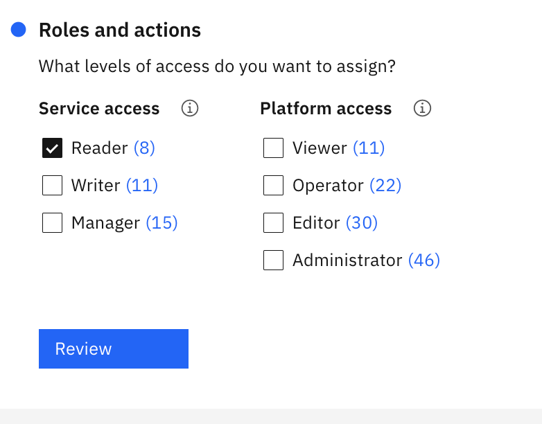

---

copyright:
  years: 2022, 2024
lastupdated: "2024-01-18"

keywords:

subcollection: atracker

content-type: tutorial
services: atracker
account-plan: lite
completion-time: 1h

---

{{site.data.keyword.attribute-definition-list}}


# Configuring an {{site.data.keyword.messagehub}} target
{: #getting-started-target-event-streams}
{: toc-content-type="tutorial"}
{: toc-services="atracker"}
{: toc-completion-time="1h"}


You can define an {{site.data.keyword.messagehub}} topic as a {{site.data.keyword.atracker_full_notm}} target to send auditing events to other corporate tools such as Security Information and Event Management (SIEM) tools.
{: shortdesc}

## Scenarios
{: #getting-started-target-event-streams-scenarios}

You can define an {{site.data.keyword.messagehub}} topic as a {{site.data.keyword.atracker_full_notm}} target to send auditing events to other corporate tools such as Security Information and Event Management (SIEM) tools. When you route data to data lakes, other analysis tools, or other SIEM tools, you can add additional capabilities to the ones provided by {{site.data.keyword.atracker_short}}:
- You can gain visibility into enterprise data across on-premises and cloud-based environments.
- You can identify and prioritize security threats that might affect your organization.
- You can detect vulnerabilities by using Artificial Intelligence (AI) to investigate threats and incidents.


## Prerequisites
{: #getting-started-target-event-streams-prereqs}

- Learn about {{site.data.keyword.atracker_short}}. For more information, see [About](/docs/atracker?topic=atracker-atracker-resources).

- Install the {{site.data.keyword.cloud_notm}} CLI. For more information, see [Installing the {{site.data.keyword.cloud_notm}} CLI](/docs/cli?topic=cli-install-ibmcloud-cli).

- Install the latest {{site.data.keyword.atracker_short}} CLI V2 plugin in your local system. See [Installing the {{site.data.keyword.atracker_short}} CLI](/docs/atracker?topic=atracker-atracker-cli-config&interface=cli).

- You need a user ID that is a member, or an owner of, an {{site.data.keyword.cloud_notm}} account. To get an {{site.data.keyword.cloud_notm}} user ID, go to: [Create an account](https://cloud.ibm.com/login){: external}.

- Every user that manages the {{site.data.keyword.atracker_short}} configuration in your account must be assigned an access policy. The policy determines what actions the user can perform. The allowable actions are customized and defined by {{site.data.keyword.atracker_short}} as operations that are allowed to be performed on the service. The actions are then mapped to IAM user roles. [Learn more](/docs/atracker?topic=atracker-iam).

    Your user ID needs **administrator platform permissions** to manage the {{site.data.keyword.atracker_full_notm}} service. Contact the account owner. The account owner can grant another user access to the account for the purposes of managing user access, and managing account resources. [Learn more](/docs/account?topic=account-userroles).


## Configure a {{site.data.keyword.messagehub}} topic
{: #getting-started-target-event-streams-step1}
{: step}


Auditing events that are collected in your account can be routed to an {{site.data.keyword.messagehub}} topic.

When you configure {{site.data.keyword.atracker_short}}, you can define a target per region. The target defines the {{site.data.keyword.messagehub}} instance and topic where auditing events in that region are routed.


Complete the following steps:

1. [Log in to your {{site.data.keyword.cloud_notm}} account](https://cloud.ibm.com/login){: external}.

2. Create an {{site.data.keyword.messagehub}} instance.

    Check the limitations of the {{site.data.keyword.messagehub}} service plans. For more information, see [Limits and quotas](https://cloud.ibm.com/docs/EventStreams?topic=EventStreams-kafka_quotas).
    {: note}

    a. Access the {{site.data.keyword.messagehub}} service in the [Catalog.](https://cloud.ibm.com/catalog#services){: external}


    b. Select the plan on the service instance page.

    c. Enter a name for your service. You can use the default value.

    d. Click **Create**. The {{site.data.keyword.messagehub}} **Getting started** page opens.

3. Select **Topics**.

4. Click **Create a topic**.

    {: caption="Create a topic" caption-side="bottom"}

5. Enter a topic name and click **Next**.

    {: caption="Enter a topic name" caption-side="bottom"}

6. Enter the number of partitions and click **Next**.

    One or more partitions make up a topic. A partition is an ordered list of messages. Partitions are distributed across the brokers in order to increase the scalability of your topic. You can also use them to distribute messages across the members of a consumer group.
    {: note}

    {: caption="Enter the number of partitions" caption-side="bottom"}

7.  Select a **Message retention** and click **Create Topic**.

    **Message retention** defines how long messages are retained before they are deleted. If your messages are not read by a consumer within this time, they will be missed.
    {: important}


## Create credentials to authenticate with {{site.data.keyword.messagehub}}
{: #getting-started-target-event-streams-step2}
{: step}

You need the following information to connect {{site.data.keyword.atracker_short}} to the {{site.data.keyword.messagehub}} instance:
- Endpoint URLs to call the APIs
- Credentials for authentication

Complete the following steps to create service credentials that {{site.data.keyword.atracker_short}} needs to communicate with the {{site.data.keyword.messagehub}} instance:

1. In the {{site.data.keyword.cloud_notm}}, click the **Menu** icon  &gt; **Resource list**.

2. Look for the {{site.data.keyword.messagehub}} instance that you plan to use, and select it.

3. In the {{site.data.keyword.messagehub}} console, click **Service credentials**.

4. Select **New credential**.

5. Enter a name and select the **writer** role.

    {: caption="Create a credential" caption-side="bottom"}

6. Click **Add**.

To restrict access to 1 topic, complete the following steps:

You must define 2 policies, 1 for the resource type `topic`, and 1 for the resource type `cluster`. For more information, see [Managing access to your {{site.data.keyword.messagehub}} resources](/docs/EventStreams?topic=EventStreams-security).

1. Modify the policy for the {{site.data.keyword.messagehub}} service to restrict access to the topic.

    1. From the menu bar, click **Manage** &gt; **Access (IAM)**, and select **Service IDS**.

        {: caption="Service IDs" caption-side="bottom"}

    2. Select the service ID.

    3. In the **Access policies** section, select the policy and modify it to specify the topic.

        For example, in the following image the topic ID is *demo-streaming*.

        {: caption="Edit policy" caption-side="bottom"}

        {: caption="Select role" caption-side="bottom"}

2. Add an access policy for the {{site.data.keyword.messagehub}} service with resource type set to `cluster`.

   1. From the menu bar, click **Manage** &gt; **Access (IAM)**, and select **Service IDS**.

        {: caption="Service IDs" caption-side="bottom"}

   2. Select the service ID.

   3. In the **Access policies** section, select **Assign access**.

   4. Add a policy for the {{site.data.keyword.messagehub}} service, resource type **cluster** with **reader** permissions.

        {: caption="Edit policy" caption-side="bottom"}

        {: caption="Select role" caption-side="bottom"}


You can [get credentials by using the {{site.data.keyword.cloud_notm}} CLI](/docs/EventStreams?topic=EventStreams-connecting#connection_information) and make note of the api key and broker URL values.
{: note}


## Create a target
{: #getting-started-target-event-streams-step3}
{: step}

To [create a target](/docs/atracker?topic=atracker-target_v2_ies&interface=cli#target-create-cli-ies), run the following command:

```text
ibmcloud atracker target create --name <TARGET_NAME> --type event-streams --endpoint <EVENT_STREAMS_ENDPOINT> --target-crn <EVENT_STREAMS_TARGET_CRN> --topic <TOPIC> --region <REGION>
```
{: pre}

Where

`--region <REGION>`
:   Name of the region that will process the events, for example, `us-south` or `eu-gb`. If not specified, the region logged into, or targeted, will be used.

`--name <TARGET_NAME>`
:   The name to be given to the target.

`--endpoint <EVENT_STREAMS_ENDPOINT>`
:   The {{site.data.keyword.messagehub}} endpoint to be associated with the topic.

`--topic <TOPIC>`
:    The name of the {{site.data.keyword.messagehub}} topic to be associated with the target.

`--target-crn <EVENT_STREAMS_TARGET_CRN>`
:   The CRN of the {{site.data.keyword.messagehub}} instance.


For example, to create a target in the US-South region, you can run the following command:

```text
ibmcloud atracker target create --name  "My target" --type event-streams --target-crn "crn:v1:bluemix:public:messagehub:eu-de:a/11111111111111111111111111111111:22222222-2222-2222-2222-222222222222::" --brokers "broker-1:9093,broker-2:9093" --topic "topic-name" --api-key xxxxx
```
{: pre}

To see the target definition in a region, see [Getting information about a target using the CLI](/docs/atracker?topic=atracker-target_v2_ies&interface=cli#target-get-cli-ies).

When your target is created the target ID is returned. Make note of the target ID. You will need the target ID to configure a rule that routes events to the target in the account.
{: note}

## Next
{: #getting-started-target-event-streams-next}
{: step}

Define 1 or more routes in the account. For more information, see [Configuring a route](/docs/atracker?topic=atracker-route_v2&interface=cli#route-create-cli).

When you configure a route, you associate a target with a route and define which type of auditing events are routed. The route defines the rules that determine where auditing events are routed in your account. For example, you can define a route that routes auditing events from 2 different regions, and also routes global events.


You can collect [global events](/docs/atracker?topic=atracker-event_types#event_types_global) and [location-based events](/docs/atracker?topic=atracker-event_types#event_types_location).
- Global events report on activity in your account that relate to data and resources that are generally synchronized across all regions.
- Location-based events report on activity in your account that is generated by IBM Cloud services that are hosted within an IBM data center location, such as US-South or US-East.
